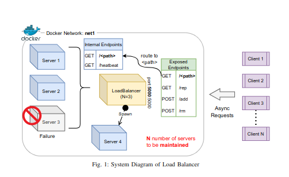
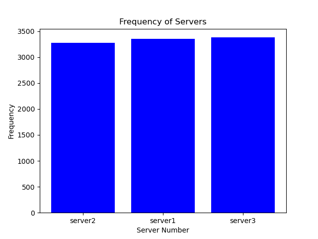
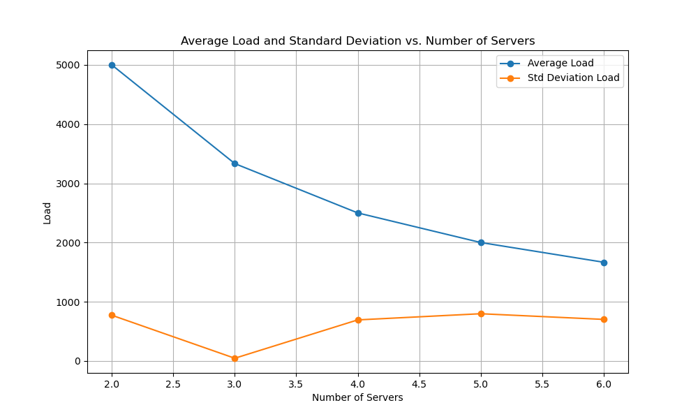

<font size=3>

# Assignment-1 Distributed Systems
This repository contains the code for the Assignment-1 of Distributed Systems(CS60002) course of Spring, 2024.

# Implementing a Customizable Load Balancer
<p align="center">
      <br><strong>Fig.1: Overview</strong>
</p>

# Table of Contents


- [Prerequisites](#prerequisites)
- [Getting Started](#getting-started)
  - [Building Docker Images](#building-docker-images)
  - [Running Docker Containers](#running-docker-containers)
  - [Interact With System](#interact-with-system)
  - [Remove Existing Container](#interact-with-system)
  - [Clear Existing Images](#clear-existing-images)
- [Design Choices](#design-choices)
- [Troubleshooting](#troubleshooting)
  - [Docker Exit with Code 137](#docker-exit-with-code-137)
  - [Removing Docker Containers](#removing-docker-containers)
- [Evaluation](#evaluation)
  - [Server Load Analysis](#server-load-analysis)
  - [Server Avg Load Analysis](#server-avg-load-analysis)
  - [Server Failure Testing](#server-failure-testing)
  - [Hashing Function Variation Analysis](#hashing-function-variation-analysis)
- [Group Details](#group-details)


# Prerequisite

## 1. Docker: latest

    sudo apt-get update

    sudo apt-get install \
        ca-certificates \
        curl \
        gnupg \
        lsb-release

    sudo mkdir -p /etc/apt/keyrings
    curl -fsSL https://download.docker.com/linux/ubuntu/gpg | sudo gpg --dearmor -o /etc/apt/keyrings/docker.gpg

    echo \
    "deb [arch=$(dpkg --print-architecture) signed-by=/etc/apt/keyrings/docker.gpg] https://download.docker.com/linux/ubuntu \
    $(lsb_release -cs) stable" | sudo tee /etc/apt/sources.list.d/docker.list > /dev/null

    sudo apt-get update

    sudo apt-get install docker-ce docker-ce-cli containerd.io

## 2. Docker-compose standalone 
    sudo curl -SL https://github.com/docker/compose/releases/download/v2.15.1/docker-compose-linux-x86_64 -o /usr/local/bin/docker-compose
    
    sudo chmod +x /usr/local/bin/docker-compose
    
    sudo ln -s /usr/local/bin/docker-compose /usr/bin/docker-compose


# Getting Started


## Building Docker Images
To create the necessary Docker images for the load balancer and servers, execute the following command:

```bash
make install
```

## Running Docker Containers
To initiate the deployment of load balancer containers, execute the following command:

```bash
make deploy
```
This command will launch the load balancer container, which, in turn, will spawn the initial N server Docker containers along with their heartbeat probing threads. Ensure that the necessary configurations are in place for a seamless deployment. The command also clears any existing containers using server or load balancer image (i.e. execute make clean).

<span style="color:red">**Note:** The deployment command launches Docker in the background mode. Therefore, users are advised to check the docker-compose logs to view load-balancer logs.</span>

## Interact with System
To interact with the load balancer and send GET/POST requests, launch the interactive terminal using the following command:

```bash
bash client.sh
```
## Remove Existing Container
To stop and remove all containers using the server image and load balancer, run the following command:

```bash
make clean
```

Executing this command is recommended before running the main code to ensure there are no conflicting container instances already running. This helps prevent potential errors and ensures a clean environment for the code execution.

## Clear Existing Images
To remove previously created server and load balancer images, execute the following command:

```bash
make deepclean
```

It is advisable to run this command before executing the main code to eliminate any pre-existing images with the same name. This ensures a clean slate and avoids potential conflicts during the code execution.

# Design Choices
<ol>
<li> When executing the /add endpoint, users may provide existing server hostnames as part of the request. In such cases, the load balancer takes a proactive approach to ensure that the specified num_add parameter is honored. Even if the user supplies hostnames that already exist in the system, the load balancer will ignore already existing hostnames and generate new hostnames for additional servers to fulfill the exact count specified by num_add.
<li> When executing the /rm endpoint, users may provide hostnames for removal. To ensure the specified number of servers to be removed is consistently achieved, the load balancer employs a strategy wherein, if the user-provided hostname doesn't exist in the system, it randomly selects and removes a server hostname from the existing set.
</ol>

# Troubleshooting

## Docker Exit with Code 137
Code 137 indicated RAM memory related issue. Stop and remove already runining container to free up space.

## Removing Docker Containers

### 1. Stop docker container
```
Particular container: docker stop container_id
Stop all runing container: docker stop $(docker ps -a -q)
```

### 2. Remove docker container
```
Particular container: docker rm container_id
Stop all runing container: docker rm $(docker ps -a -q)
```


# Evaluation

## Server Load Analysis
To analyze the distribution load of 10,000 asynchronous requests on N=3 servers, follow these commands:

#### Change to the 'analysis' directory:

```bash
cd analysis
```
#### Run the Python script for analysis:
```bash
python analysis.py
```

The analysis.py script sends 10,000 asynchronous requests (/home requests) to the load balancer. Based on the responses received, it plots a frequency map illustrating how many responses come from each server.

Ensure that the necessary dependencies are installed and the system is properly configured before executing the analysis script.




## Server Avg Load Analysis



## Server Failure Testing
## Hashing Function Variation Analysis
After testing various combinations of ** SHA-256, SHA-1, and MD5** for request and server hashing (3x3 matrix), we found that the most effective combination is:

- Server Hashing: SHA-1
- Request Hashing: MD5

To implement this new hash function configuration, follow these steps:

1. Open the file `load_balancer/consistent_hashing.py` and locate the `server_hash_func`  and `request_hash_func` definition.

2. Comment the alternative hash function provided. 

3. Save the changes.

4. Re-run the analysis script after deploying the load balancer again.

5. Ensure that you have cleared previous containers and images, and rebuild the project before executing the analysis script. This ensures that the new hash function is applied to the load balancer and the analysis is based on the updated configuration.

The evaluation results of new hash function on variable number of servers are present in `analysis/md5_hash`

# Group Details
1. Pranav Mehrotra (20CS10085)
2. Saransh Sharma (20CS30065)
3. Pranav Nyati (20CS30037)
4. Shreyas Jena (20CS30049)

</font>